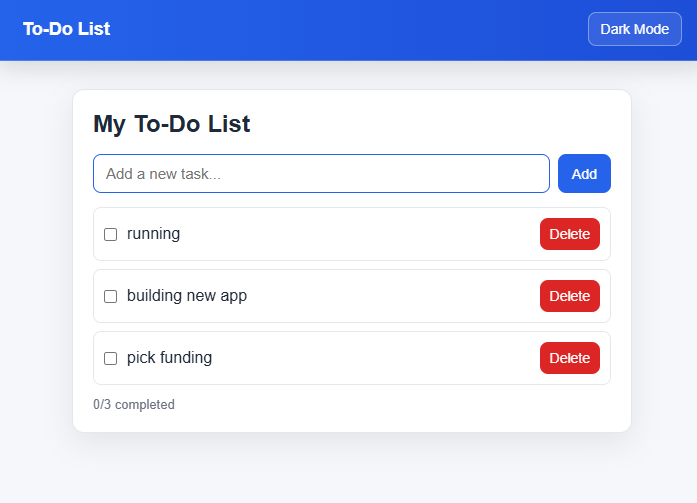
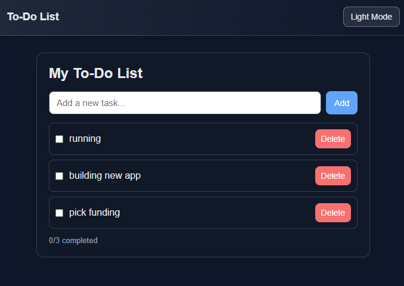
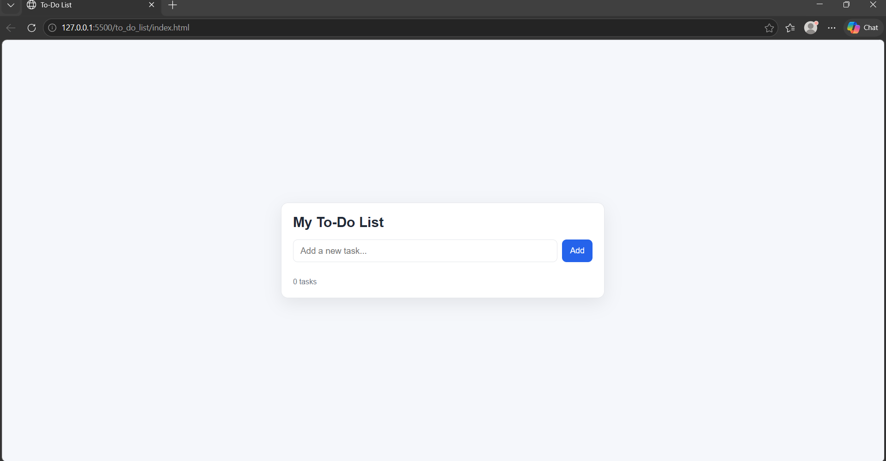
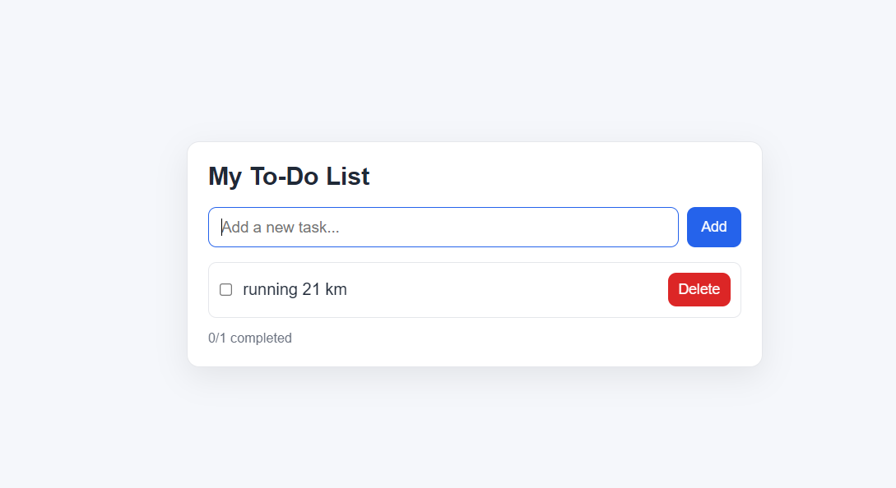
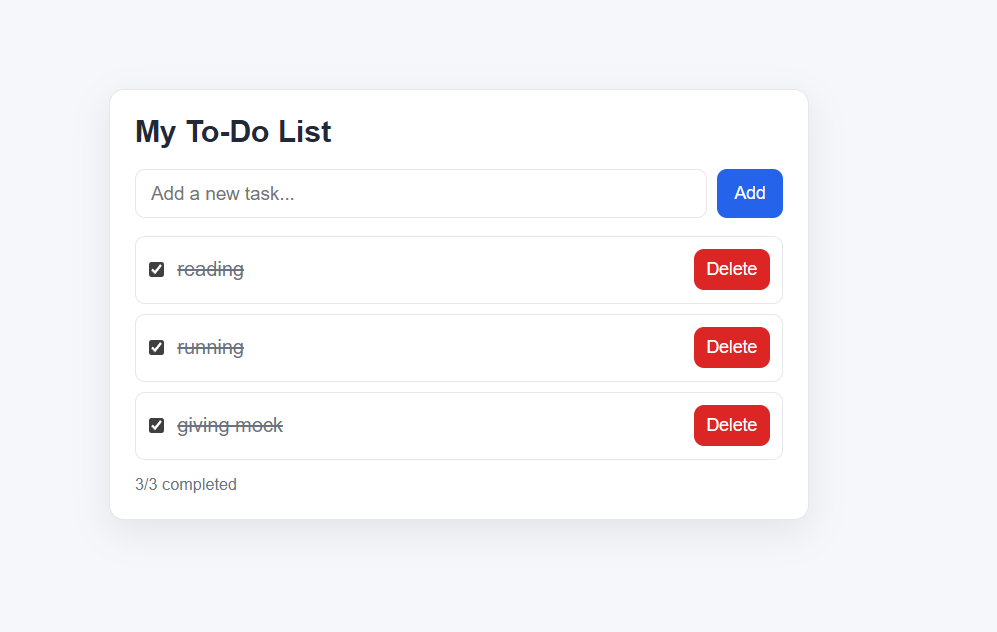

# To-Do App

A simple and clean to-do list web app built with plain HTML, CSS, and JavaScript.

## Features

- Add new tasks
- Mark tasks as completed
- Delete tasks
- View live completion count (`completed/total`)
- Press `Enter` to quickly add tasks
- Dark and light theme toggle in the navbar
- Smooth animations for adding, completing, and deleting tasks

## Project Structure

- `index.html` - App layout and element structure
- `style.css` - Styling for the interface
- `script.js` - To-do list logic and interactions

## How to Run

1. Open the project folder.
2. Double-click `index.html` (or open it in any browser).
3. Start adding your tasks.

No installation or dependencies are required.

## Screenshots

> Add your screenshots in a `screenshots/` folder and keep these names for auto-display.
>
> Quick capture on Windows:
> - Press `Win + Shift + S` to open Snipping Tool.
> - Select the app area and save the image.
> - Save files in `screenshots/` using the names below.

### Light Theme

### Dark Theme

### Main View

### Task Added

### Completed Tasks

## Tech Stack

- HTML5
- CSS3
- JavaScript (Vanilla)

## Future Improvements

- Save tasks in browser storage using `localStorage`
- Add task filters: `All`, `Active`, and `Completed`
- Add edit task support
- Add clear completed tasks action
- Add due dates and simple priority tags
